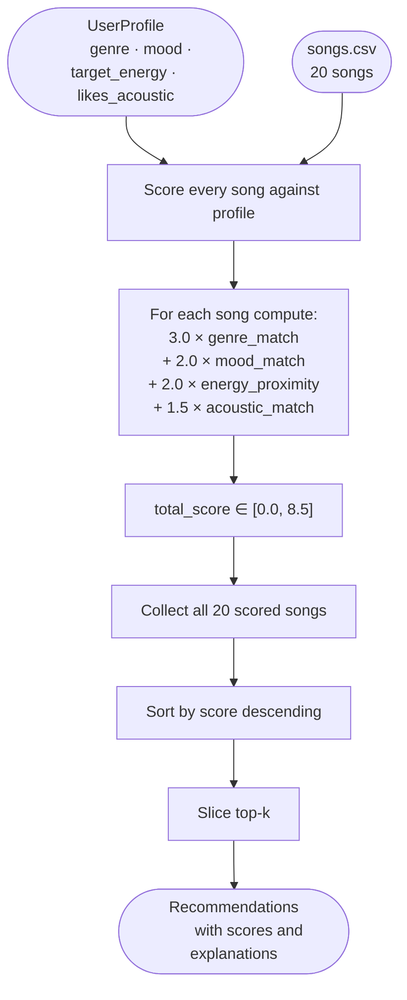
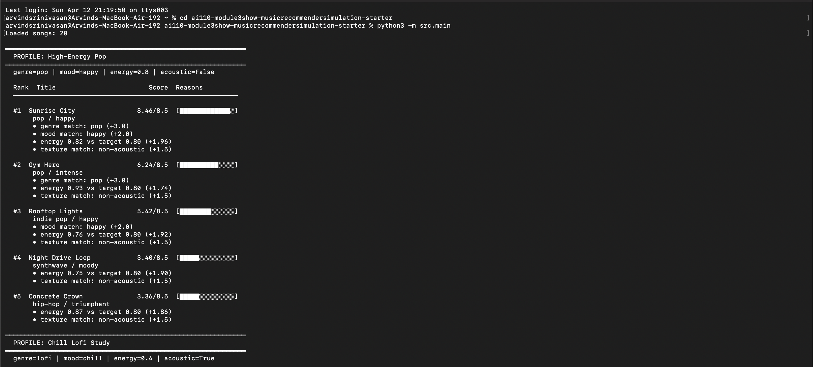
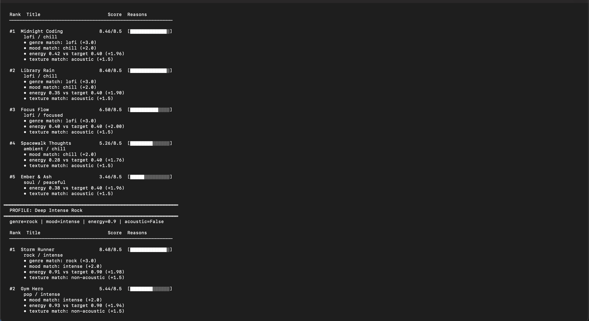
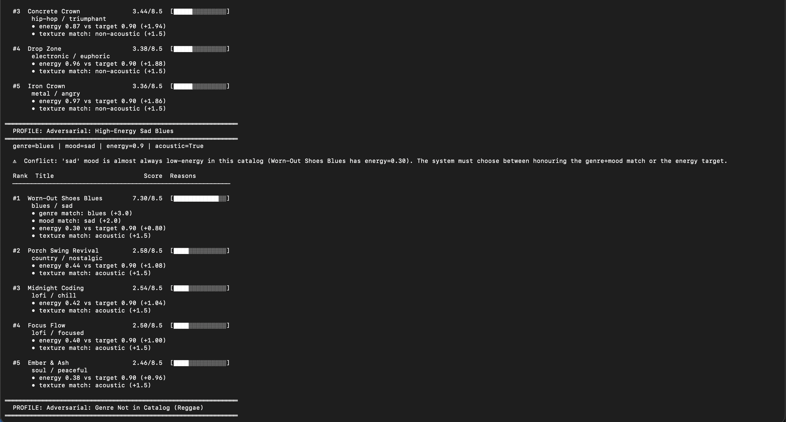
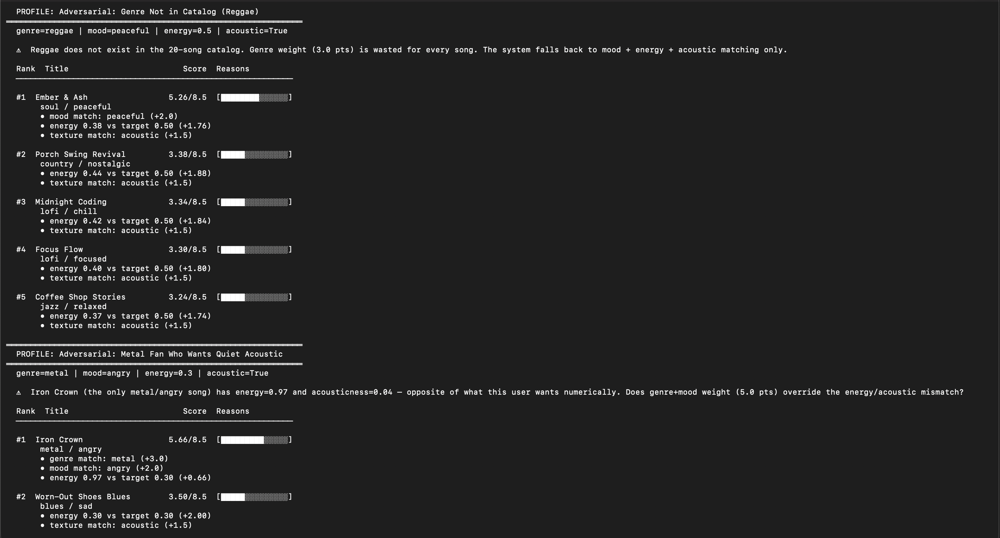
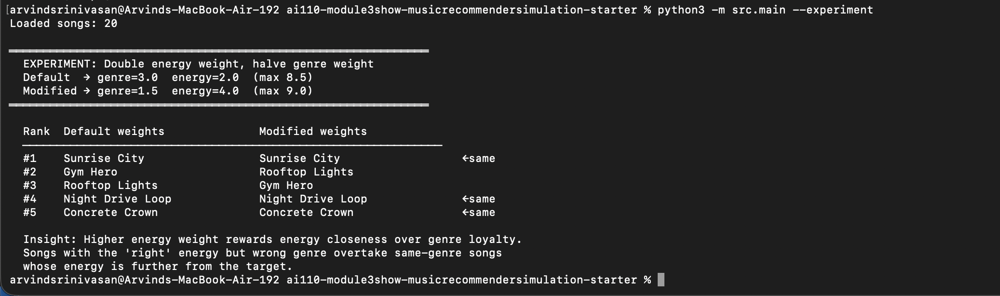

# 🎵 Music Recommender Simulation

## Project Summary

In this project you will build and explain a small music recommender system.

Your goal is to:

- Represent songs and a user "taste profile" as data
- Design a scoring rule that turns that data into recommendations
- Evaluate what your system gets right and wrong
- Reflect on how this mirrors real world AI recommenders

This project builds a small content-based music recommender that scores a 20-song catalog against a user taste profile and returns the top matches. It prioritizes "vibe alignment" — matching the emotional and sonic feeling a listener wants in a session — over simple feature maximization. The system is intentionally transparent: every score is a weighted sum of explainable features, so you can see exactly why each song was recommended.

---

## How The System Works

Real-world platforms like Spotify combine two approaches: **collaborative filtering**, which finds patterns across millions of users ("people who liked X also liked Y"), and **content-based filtering**, which compares a song's intrinsic audio attributes to a listener's known preferences. Production systems layer both methods and add deep learning on top, but both ultimately rely on the same insight: a user's next favorite song is probably close in "feature space" to what they already love.

This simulation uses **content-based filtering only**. Instead of rewarding songs that score highest on a single attribute (e.g., highest energy), the system scores each song by how *close* its features are to the user's stated preferences. A user who wants medium energy (0.40) gets penalized for songs that are too loud just as much as songs that are too quiet. Categorical features like genre and mood use a binary match, but are weighted more heavily than numeric features because they represent stronger, less negotiable listener preferences. The final recommendation is the top-k songs sorted by total score — combining a **scoring rule** (one song at a time) with a **ranking rule** (sort and slice the whole catalog).

### Song Features

| Feature | Type | Role in scoring |
|---|---|---|
| `genre` | categorical | Hard preference match — highest weight (3.0) |
| `mood` | categorical | Emotional intent match — second highest weight (2.0) |
| `energy` | float 0–1 | Proximity to `target_energy` — weight 2.0 |
| `acousticness` | float 0–1 | Organic/electronic texture match — weight 1.5 |
| `tempo_bpm` | float 60–160 | Normalized, then proximity scored — weight 1.0 |
| `valence` | float 0–1 | Emotional positivity (reserved for future weighting) |
| `danceability` | float 0–1 | Rhythmic intensity (least discriminating in this catalog) |
| `title`, `artist` | string | Display only — not used in scoring |

### UserProfile Fields

| Field | Type | What it captures |
|---|---|---|
| `favorite_genre` | string | The listener's primary genre (e.g. `"lofi"`, `"rock"`) |
| `favorite_mood` | string | The session mood they are seeking (e.g. `"chill"`, `"intense"`) |
| `target_energy` | float 0–1 | How energetic they want the music to feel |
| `likes_acoustic` | bool | Whether they prefer organic/acoustic sound over produced/electronic |

### Step 2 — Sample User Profile

The system is designed around a concrete "taste profile" that can be swapped for any listener:

```python
user_prefs = {
    "favorite_genre":  "lofi",    # hard genre constraint
    "favorite_mood":   "chill",   # session-level emotional intent
    "target_energy":   0.40,      # mid-low intensity (study / background)
    "likes_acoustic":  True,      # prefers organic sound over produced/electronic
}
```

**Profile critique** (verified against the 20-song catalog):

This profile cleanly separates the two extremes. *Midnight Coding* (lofi/chill, energy 0.42) scores **8.46** while *Storm Runner* (rock/intense, energy 0.91) scores **0.98** — a **7.48-point gap**, well beyond any scoring ambiguity.

However, the profile has a deliberate narrowness: only 3 of 20 songs share the `lofi` genre, so the top-3 recommendations will almost always be the same lofi titles. Songs with a similarly chill sonic texture — *Spacewalk Thoughts* (ambient/chill, score 5.26) and *Ember & Ash* (soul/peaceful, score 3.46) — rank below any lofi song regardless of how well they match on energy and acousticness. This is a known trade-off, not a bug: genre represents the listener's deepest preference and deserves the highest weight.

One notable edge case: *Focus Flow* (lofi/**focused**, score 6.50) ranks above *Spacewalk Thoughts* (ambient/**chill**, score 5.26) because it shares the genre even though its mood does not match. A user who strictly wants "chill" might prefer the reverse ordering — this is addressed in the Limitations section.

### Step 3 — Finalized Algorithm Recipe

**Scoring weights** (starting point from the module was `+2.0 genre, +1.0 mood`; the weights below were raised after analysis of the full 20-song catalog):

| Component | Formula | Weight | Reasoning |
|---|---|---|---|
| Genre match | `1.0 if song.genre == user.genre else 0.0` | **3.0** | Genre is the hardest listener constraint — a jazz fan will skip metal regardless of other features |
| Mood match | `1.0 if song.mood == user.mood else 0.0` | **2.0** | Mood is negotiable (chill and relaxed can co-exist) but still a strong session signal |
| Energy proximity | `1.0 − abs(user.target_energy − song.energy)` | **2.0** | Rewards closeness, not magnitude — a user wanting 0.40 energy is penalized equally for 0.20 or 0.60 |
| Acoustic match | `1.0 if (song.acousticness > 0.5) == user.likes_acoustic else 0.0` | **1.5** | Captures the organic/electronic texture divide; weighted below mood because it is binary and coarse |

**Scoring at a Glance:**

```
total_score(user, song) =
    3.0 × (genre match)
  + 2.0 × (mood match)
  + 2.0 × (1 − |user.target_energy − song.energy|)
  + 1.5 × (acoustic texture match)

Maximum possible score: 8.5
```

**Full ranking for the sample profile** (lofi / chill / 0.40 energy / likes acoustic):

| Rank | Song | Genre | Mood | Score |
|---|---|---|---|---|
| 1 | Midnight Coding | lofi | chill | 8.46 |
| 2 | Library Rain | lofi | chill | 8.40 |
| 3 | Focus Flow | lofi | focused | 6.50 |
| 4 | Spacewalk Thoughts | ambient | chill | 5.26 |
| 5 | Ember & Ash | soul | peaceful | 3.46 |
| … | *(songs 6–16 cluster 1.06–3.44)* | | | |
| 17 | **Storm Runner** | **rock** | **intense** | **0.98** |
| 20 | Iron Crown | metal | angry | 0.86 |

### Step 4 — Data Flow



The loop **Input → Score → Collect → Sort → Slice** maps directly to the three functions in `src/recommender.py`: `score_song()` handles the inner box, `recommend_songs()` / `Recommender.recommend()` handles everything from Collect onward.

---

## Getting Started

### Setup

1. Create a virtual environment (optional but recommended):

   ```bash
   python -m venv .venv
   source .venv/bin/activate      # Mac or Linux
   .venv\Scripts\activate         # Windows

2. Install dependencies

```bash
pip install -r requirements.txt
```

3. Run the app:

```bash
python -m src.main
```

### Running Tests

Run the starter tests with:

```bash
pytest
```

You can add more tests in `tests/test_recommender.py`.

---

## Experiments You Tried

### Experiment 1 — All 6 user profiles (3 normal + 3 adversarial)

Run: `python3 -m src.main`










*Sunrise City scores 8.46/8.5 for the High-Energy Pop profile — a near-perfect match on genre, mood, energy, and texture. The adversarial profiles reveal the system's limits: the Metal Fan Who Wants Quiet Acoustic profile still gets Iron Crown at #1 (5.66/8.5) because genre+mood weight (5.0 pts) overrides the energy and acoustic mismatch.*

---

### Experiment 2 — Weight shift: double energy, halve genre

Run: `python3 -m src.main --experiment`



*With energy weight doubled (2.0 → 4.0) and genre halved (3.0 → 1.5), Rooftop Lights swaps with Gym Hero at ranks 2 and 3. Rooftop Lights has energy 0.76 (close to the 0.80 target) while Gym Hero has energy 0.93 (further away). Higher energy weight rewards closeness over same-genre loyalty.*

---

## Limitations and Risks

### Step 5 — Known Biases

| Bias | What you'll observe | Root cause | Mitigation |
|---|---|---|---|
| **Genre lock** | The top-3 recommendations are almost always the same 3 lofi songs | Genre weight (3.0) dominates; only 3/20 songs are lofi | Reduce `w_genre` to 2.0 or add a "diversity bonus" that penalizes repeated genres in the top-k |
| **Mood-genre conflict** | *Focus Flow* (lofi/focused, score 6.50) outranks *Spacewalk Thoughts* (ambient/chill, score 5.26) even though the user asked for "chill" | Genre match (3 pts) outweighs mood mismatch (−2 pts net vs match) | Swap `w_genre` and `w_mood` for users who declare their mood as the primary session intent |
| **Binary acoustic coarseness** | *Golden Hour Drift* (r&b, acousticness=0.45) scores 0 on acoustic even though 0.45 is close to the 0.5 threshold | Acoustic is scored as a hard binary, not a proximity score | Replace the binary with a proximity formula: `1.0 − abs(user_target_acousticness − song.acousticness)` |
| **Catalog sparsity per genre** | After a few sessions the system feels repetitive | 20 songs with 17 genres means most genres have only 1–2 songs | Expand the catalog or down-weight genre and up-weight energy/acousticness for "discovery" sessions |
| **No sequential context** | Every session starts fresh; the system cannot learn "I just heard 3 lofi songs, show me something different" | The recommender is stateless — no session history | Add a "recently played" penalty in `recommend_songs()` |

---

## Reflection

Read and complete `model_card.md`:

[**Model Card**](model_card.md)

Write 1 to 2 paragraphs here about what you learned:

- about how recommenders turn data into predictions
- about where bias or unfairness could show up in systems like this


---

## 7. `model_card_template.md`

Combines reflection and model card framing from the Module 3 guidance. :contentReference[oaicite:2]{index=2}  

```markdown
# 🎧 Model Card - Music Recommender Simulation

## 1. Model Name

Give your recommender a name, for example:

> VibeFinder 1.0

---

## 2. Intended Use

- What is this system trying to do
- Who is it for

Example:

> This model suggests 3 to 5 songs from a small catalog based on a user's preferred genre, mood, and energy level. It is for classroom exploration only, not for real users.

---

## 3. How It Works (Short Explanation)

Describe your scoring logic in plain language.

- What features of each song does it consider
- What information about the user does it use
- How does it turn those into a number

Try to avoid code in this section, treat it like an explanation to a non programmer.

---

## 4. Data

Describe your dataset.

- How many songs are in `data/songs.csv`
- Did you add or remove any songs
- What kinds of genres or moods are represented
- Whose taste does this data mostly reflect

---

## 5. Strengths

Where does your recommender work well

You can think about:
- Situations where the top results "felt right"
- Particular user profiles it served well
- Simplicity or transparency benefits

---

## 6. Limitations and Bias

Where does your recommender struggle

Some prompts:
- Does it ignore some genres or moods
- Does it treat all users as if they have the same taste shape
- Is it biased toward high energy or one genre by default
- How could this be unfair if used in a real product

---

## 7. Evaluation

How did you check your system

Examples:
- You tried multiple user profiles and wrote down whether the results matched your expectations
- You compared your simulation to what a real app like Spotify or YouTube tends to recommend
- You wrote tests for your scoring logic

You do not need a numeric metric, but if you used one, explain what it measures.

---

## 8. Future Work

If you had more time, how would you improve this recommender

Examples:

- Add support for multiple users and "group vibe" recommendations
- Balance diversity of songs instead of always picking the closest match
- Use more features, like tempo ranges or lyric themes

---

## 9. Personal Reflection

A few sentences about what you learned:

- What surprised you about how your system behaved
- How did building this change how you think about real music recommenders
- Where do you think human judgment still matters, even if the model seems "smart"

